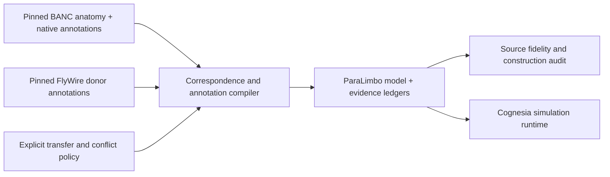

# ParaLimbo 0.1.0-alpha.1

ParaLimbo is a reproducible BANC–FlyWire annotation integration for Cognesia.
It recovers omitted native chemical evidence and records conservative
cross-specimen transfers. Improved biological prediction is **not established**.

| Identity | Value |
| --- | --- |
| Provider | `paralimbo-v0-1-0` |
| Release tag | `paralimbo-v0.1.0-alpha.1` |
| Model hash | `251615940b84dad843d0cf85138c936e118b0890274231bb8e5720b5b381bb5c` |
| Anatomical base | Adult female *Drosophila melanogaster*, BANC materialization 888 |
| Donor evidence | Pinned FlyWire 783 neuron annotations |
| Model size | 175,401 neurons; 13,542,180 directed connections |
| Wiring changes | Zero; six BANC sparse-array files are byte-identical |
| Electrical modes | Existing BANC partition: 1,846 graded and 173,555 spiking neurons |

Intended uses are inspecting evidence, reproducing the integration, and
exploratory simulation under declared assumptions. Each BANC neuron retains
its original identity. The combined annotations describe evidence from multiple
specimens; they are not measurements of one complete fly.

The release preserves BANC's existing electrical-mode and synaptic-sign
assumptions. It does not import FlyWire's assumed graded/spiking rules, replace
circuits, or establish receptor expression, release kinetics or concentrations.
Chemical fields use arbitrary units. Source membership is distinct from an
enabled physiological effect: NO has no dedicated enabled receptor effect, and
the BANC provider does not enable the KC→MBON sNPF/plasticity pathway.

Morphological registration, detailed body mechanics, validated behavior,
global numerical stability and biological superiority are outside the
established results of this preview. Historical failures in [REPORT.md](../../REPORT.md)
remain relevant and are not superseded by a construction audit.

See [results](results.md), [provenance](provenance.md),
[validation protocol](validation-protocol.md), and [reproduction](reproduce.md).
Original Cognesia code and documentation remain all rights reserved; upstream
data and components retain their own terms. See [LICENSE](../../LICENSE) and
[third-party notices](../../THIRD_PARTY_NOTICES.md).
