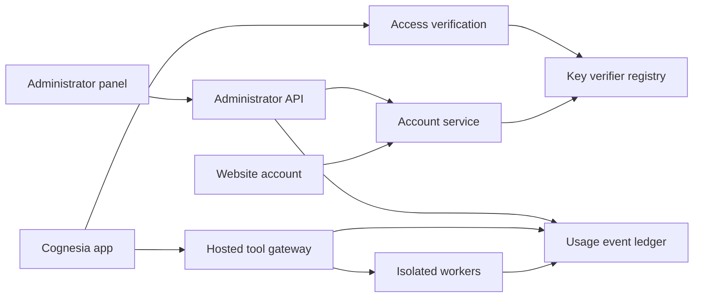

# Cognesia accounts and usage administration plan

**2026-10-09 public-signup implementation:** The personal-key service is moving
to Netlify Free with Firebase Spark for verified email and Google sign-in.
Billing stays disabled and phone signup stays off. The confirmed connection
location policy blocks CN, CU, LA, KP and VN. The Netlify adapter and real-emulator
flow pass; public deployment and real signup verification are pending Netlify
CLI authorization. See [`services/accounts`](../services/accounts/README.md).
The usage/admin milestones below remain separate work.

The website will let users create an account, obtain their own personal access
key, and see their usage. The owner will have a separate administrator panel
for account status, key revocation, quotas and measured hosted usage. Signup
and access remain free. This is an implementation plan; it does not establish
a deployed account service or live administrator panel.

## Existing components and required additions

| Component | Existing implementation | Planned addition |
| --- | --- | --- |
| Website | Capability pages and an existing-key API console in `site/` | Signup, verification, account settings, key management and personal usage pages |
| Access keys | Verifier-only keys, expiry, rotation, revocation and read/run scopes in `api_credentials.py` | Authenticated self-service issuance after account verification and provisioning |
| API gateway | Workspace isolation, tool authorization and idempotent requests in `public_api.py` | Account policy checks, quota reservations and metering events |
| App access | Personal-key verification work in the Cognesia 0.0.2 release | Website sign-in and setup instructions linked from the app's access screen |
| Usage | Request/replay ledger for dispatch correctness | Dedicated measured-usage ledger and aggregation |
| Administration | Local administrative key commands | Administrator-only API and dashboard with an audit trail |

Here, an access key is a bearer credential, not a biometric or WebAuthn passkey.
Account sign-in, application keys and administrator authorization have distinct
roles. A customer API key never grants administrator access.

## User journey

1. A visitor signs up with an email address and accepts the published access
   terms and usage notice. Signup returns a generic response to avoid disclosing
   existing accounts.
2. A single-use, short-lived email link verifies the address. The initial design
   uses email links for account sign-in; the email provider and production origin
   must be configured before launch.
3. A provisioning job creates the account's isolated hosted workspace if hosted
   compute is enabled. Failures leave the account pending and retry safely;
   registration alone must not start expensive simulations.
4. The account page issues an individual named access key and displays its secret
   once. Later visits show only its identifier, scope, creation, expiry and last
   use. Users can revoke or rotate their own keys.
5. The user enters the key in the official Cognesia app or website console.
   Authorization and limits are checked server-side for hosted operations.
6. The usage page explains consumed and remaining limits, in-flight jobs and
   whether a value is measured by the host or reported by a local device.
7. Recovery re-verifies account ownership and offers key revocation/rotation.
   Resetting sign-in credentials must not silently preserve compromised sessions.

## Service structure

Keep the public site and public API behind HTTPS. The gateway and workers remain
private services. The administrator API uses a distinct role and strongly
authenticated account, with MFA before public deployment. Bootstrap the first
administrator through an offline command; never infer administrator status from
an email supplied at signup.

GitHub Pages can serve static presentation files. Accounts, email delivery,
key verification, provisioning and usage storage require an application host.
The domain, host, email service, operating limits and backup destination remain
deployment decisions. [GitHub Pages documentation](https://docs.github.com/en/pages/getting-started-with-github-pages/what-is-github-pages).

## Account and key records

| Record | Essential fields and invariants |
| --- | --- |
| Account | Opaque ID, verified email, status, creation time, role and policy version; role changes require an administrator |
| Email challenge | Hashed random token, purpose, account binding, expiration and consumed time; single use and rate limited |
| Website session | Hashed session identifier, account, expiration and revocation; Secure, HttpOnly cookies with appropriate SameSite and CSRF checks |
| Access key | Existing random key ID and verifier, account, scope, expiry, revocation, name and last use; never store the bearer secret |
| Workspace | Account ownership, immutable worker binding and isolated mutable directories; preserve current gateway isolation guarantees |
| Device | Account, random installation identifier, last verified activity and telemetry preference; no hardware fingerprint required |
| Audit event | Actor, action, target, time, outcome and correlation ID; exclude secrets and research payloads |

Preserve the existing registry during migration. Back up and version the schema,
map every existing customer to an account, and retain immutable worker ownership.
Do not allow signup to claim an existing customer/workspace identifier.

## Usage definitions

Account usage must be reproducible from events, with a stated time window and
UTC event timestamps. The dashboard can display the viewer's chosen timezone.

| Metric | Definition |
| --- | --- |
| Requests | Authorized gateway requests, shown separately from rejected authentication attempts |
| Executed operations | Unique dispatched operation IDs; replaying an idempotent response adds no execution |
| Simulated time | Sum of actual completed model time from run records, in milliseconds; requested duration is a separate field |
| Compute wall time | Worker execution end minus start, excluding queue time |
| CPU time | Measured process-tree CPU seconds; do not infer it from wall time or thread count |
| GPU time | Measured GPU execution time only when instrumentation supports it; otherwise unavailable |
| Peak memory | Measured per-job peak process-tree memory with sampling interval and units |
| Storage | Actual retained per-account bytes, including outputs and checkpoints under the published accounting policy |
| Outcomes | Completed, failed, cancelled, running and outcome-unknown jobs reported separately |

Use an append-only job-event stream with a unique event ID and operation ID.
Deduplicate retries. Record start, progress where needed, completion, failure,
cancellation and reconciliation after worker restart. Aggregate daily summaries
from this stream; keep a reconciliation job that compares summaries to events.
Represent missing measurements as unavailable, not zero.

Reserve quotas atomically before dispatch so concurrent requests cannot each
spend the same remaining allowance. Settle reservations against actual completed
usage and reconcile abandoned jobs. Preserve separate limits for concurrent
jobs, simulated time, compute resources and retained storage.

Hosted measurements are authoritative for hosted usage. Local-device telemetry
is explicitly reported and may be incomplete, offline or altered by modified
clients. Do not present local reports as verified metering. Publish what is
collected and provide an explicit local-telemetry setting. The proposed default
is hosted accounting only; local telemetry is opt-in.

## Administrator panel

The owner should be able to filter by date, account, model and job outcome;
inspect per-user usage and remaining quotas; identify active or stalled jobs;
disable accounts; revoke keys; adjust limits; and request cancellation of a
hosted job. Revocation prevents later authorized requests; an already-running
job requires a separate cancellation operation and outcome check.

Account detail shows verification/status, key identifiers and last use,
workspaces, recent job metadata and usage totals. It never displays key secrets,
private experiment contents or local-device files. Export only the minimal
usage fields needed for administration. Record all administrative mutations in
the audit log and require reauthentication for sensitive actions.

## Implementation milestones

| Milestone | Completion criteria |
| --- | --- |
| A account foundation | Signup, verified sign-in, session expiry, account recovery and safe registry migration pass isolated tests |
| B personal keys | Issue-once, own-key listing, rotation and revocation work; cross-account key access is rejected |
| C provisioning and usage | Dedicated workers, atomic quota checks, retry-safe metering and restart reconciliation pass controlled job tests |
| D administrator panel | Owner-only views/actions, measured usage totals, filtering and audit log pass authorization and accounting checks |
| E public deployment | Real HTTPS origin, email delivery, protected secrets, backups, account isolation and end-to-end signup-to-app access are verified |

For each milestone test both normal and failure cases: duplicate signups,
expired/reused email links, CSRF, account enumeration, key leakage, invalid and
revoked credentials, cross-account requests, concurrent quota spending,
idempotent retries, worker crashes and unavailable services. Compare dashboard
totals against a fixed test-event ledger. Include a real browser signup and
app-unlock check on the deployed origin before announcing availability.

Keep the security requirements aligned with the
[OWASP REST security guidance](https://cheatsheetseries.owasp.org/cheatsheets/REST_Security_Cheat_Sheet.html).
The existing [customer gateway documentation](customer-website.md) describes
the current manual provisioning path and deployment boundaries.
